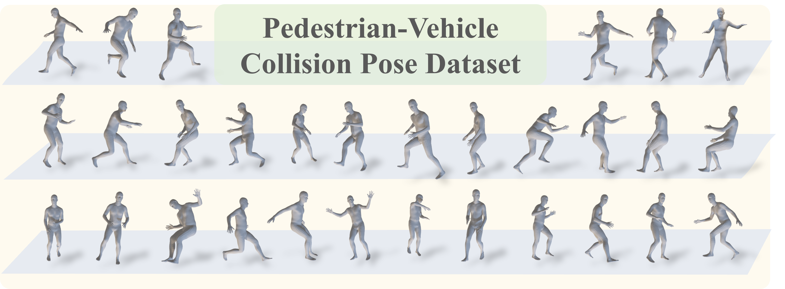
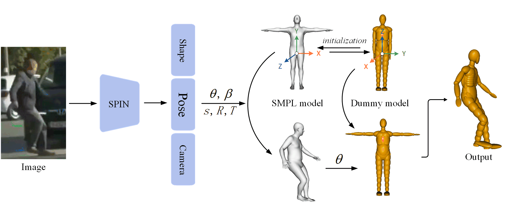

👋 Welcome to my homepage! Feel free to reach out if you have any questions. 
Sharing, contributing, open-sourcing, and helping others are some of my greatest joys!



Education
======
* Ph.D in Beijing University of Science and Technology, 2023.09-Present
* M.S. in Beijing University of Science and Technology, 2020.09-2023.06
* B.S. in Beijing University of Science and Technology, 2016.09-2020.06

Research Interests
======
* Autonomous Driving, Computer Vision
* Human Pose Estimation and Generation
* Vehicle Active and Passive Protection Technology for Pedestrian Safety

Work experience
======
* 2023.09-present: Beijing University of Science and Technology
  * Ph.D Student
  * Smart Vehicle Lab 
  * Environment Perception for Intelligent Vehicles
    
* 2016.09-2023.06: Beijing University of Science and Technology
  * Student
  * School of Mechanical Engineering
  * Department of Vehicle Engineering

* 2023.03-2023.09: Lenovo Research
  * Intern Researcher
  * 3D Hand Pose Estimation
  
Publications
======
* You can find my articles on [my Google Scholar profile](https://scholar.google.com/citations?user=Ganf8zgAAAAJ&hl=zh-CN)
* You can find my projects on [my Github profile](https://github.com/wmj142326)
* First-Author Publications
  
  > 
  > 
  > <table>
  >   <tr>
  >     <td></td>
  >     <td>
  >       <a href="https://scholar.google.com/scholar?hl=zh-CN&as_sdt=0%2C5&q=Pedestrian-Centric+3D+Pre-collision+Pose+and+Shape+Estimation+from+Dashcam+Perspective&btnG="><strong>Pedestrian-Centric 3D Pre-collision Pose and Shape Estimation from Dashcam Perspective</strong></a> 
  >       <strong class="highlight">MeiJun Wang</strong>, Yu Meng*, Zhongwei Qiu, Chao Zheng, Yan Xu, Pengxiaorui, Jian Gao 
  >       (NeurIPS 2024) The Thirty-eighth Annual Conference on Neural Information Processing Systems 
  >       <a href="https://openreview.net/pdf?id=ldvfaYzG35" class="link">PDF</a>
  >       <a href="https://github.com/wmj142326/PVCP" class="link">Code1</a>
  >       <a href="https://github.com/wmj142326/SMPL_Tools" class="link">Code2</a>
  >       <a href="https://neurips.cc/virtual/2024/poster/93814" class="link">More</a>
  >     </td>
  >   </tr>
  >   <tr>
  >     <td></td>
  >     <td>
  >       <a href="https://scholar.google.com/scholar?hl=zh-CN&as_sdt=0%2C5&q=Real-Time+Reconstruction+of+Multi-Body+Pedestrian+Pre-Impact+Posture+in+Collision+Accidents+From+Monocular+Images&btnG="><strong>Real-Time Reconstruction of Multi-Body Pedestrian Pre-Impact Posture in Collision Accidents From Monocular Images</strong></a> 
  >       <strong class="highlight">MeiJun Wang</strong>, Yu Meng*, Yan Xu, Quan Li, Bingbing Nie 
  >       (TITS) IEEE Transactions on Intelligent Transportation Systems, 2024 
  >       <a href="https://ieeexplore.ieee.org/abstract/document/10746249" class="link">PDF</a>
  >       <a href="https://github.com/wmj142326/MBPR" class="link">Code</a>
  >     </td>
  >   </tr>
  > </table>

* Co-authored Publications

  ><a href="https://scholar.google.com/scholar?hl=zh-CN&as_sdt=0%2C5&q=Few-shot+Point+Cloud+Semantic+Segmentation+via+Support-Query+Feature+Interaction&btnG=" style="font-size: 13px;"><strong>Few-shot Point Cloud Semantic Segmentation via Support-Query Feature Interaction</strong></a> 
  > C Zheng, L Liu, Y Meng, X Peng, **M Wang** 
  > (TCSVT) IEEE Transactions on Circuits and Systems for Video Technology 
  > 
  ><a href="https://scholar.google.com/scholar?hl=zh-CN&as_sdt=0%2C5&q=+Meijun+Wang+Passable+area+segmentation+for+open-pit+mine+road+from+vehicle+perspective&btnG=" style="font-size: 13px;"><strong>Passable area segmentation for open-pit mine road from vehicle perspective</strong></a> 
  > C Zheng, L Liu, Y Meng, **M Wang**, X Jiang 
  > (EAAI) Engineering Applications of Artificial Intelligence 129, 107610

Skills
======
* Welcome to my read sharing: [陌尘小小-Zhihu](https://www.zhihu.com/people/mochenxiaoxiao)
* Welcome to my video sharing: [陌尘小小-BiliBili](https://space.bilibili.com/384233049)

QR Code
======
  
  
  

    <!-- Left column: QR code image -->
    

      
    

  
    <!-- Right column: Statistics text -->
    

      <!-- Include Busuanzi visit statistics script -->
      
      
      <!-- Page View Count -->
      

        Page Views:  times
      

      
      <!-- Unique Visitors -->
      

        Unique Visitors:  people
      

      <!-- Comments -->
      

        Feel free to leave your thoughts [Here 💬](https://github.com/wmj142326/wmj142326.github.io/issues/new?title=Comment&body=Your%20comment%20here).
      

    

  

